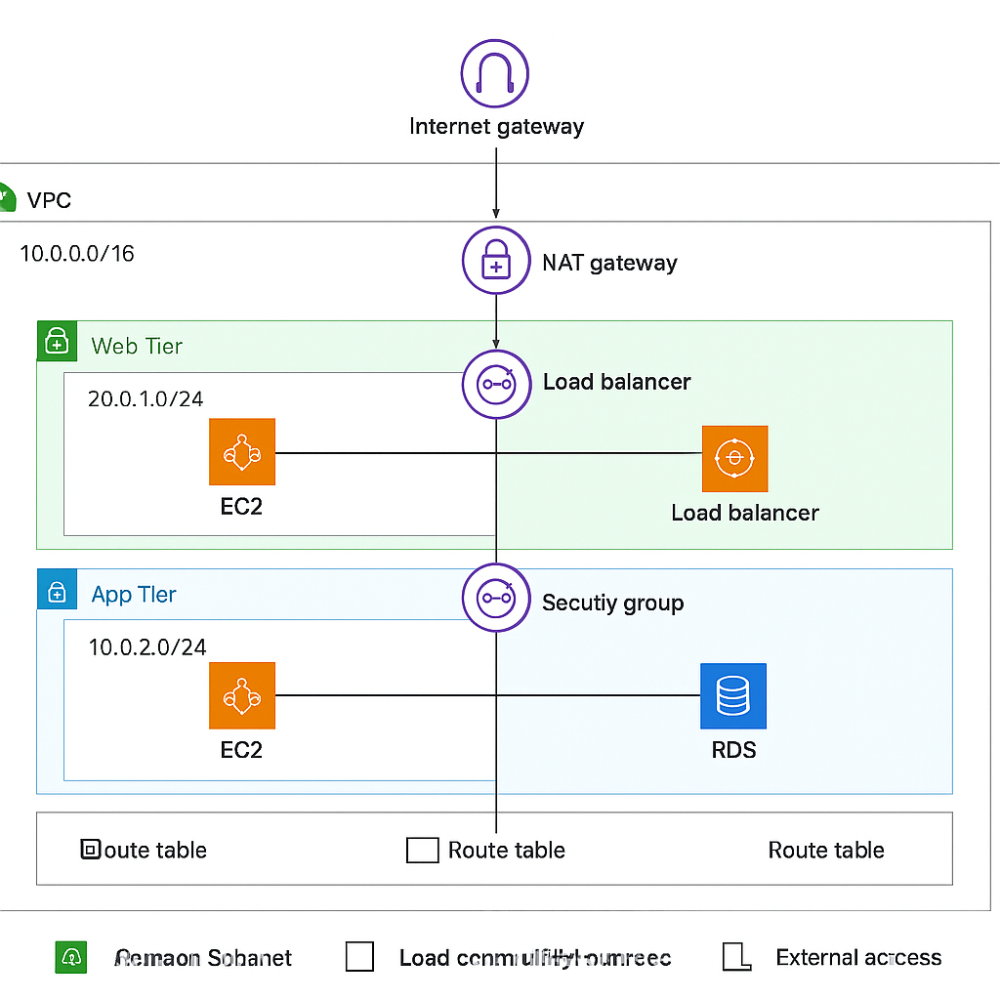

# 🌐 AWS 3-Tier Web Application Deployment Project

This project demonstrates the deployment of a **3-Tier Web Application Architecture** on **AWS Cloud** — including Web, Application, and Database tiers using EC2, RDS, ALB, and S3.

---

## 🏗️ Architecture Overview

The architecture follows the standard **3-Tier Model**:

| Tier | Description | AWS Services Used |
|------|--------------|-------------------|
| **Web Tier** | Handles user requests through a public load balancer and routes traffic to web servers | EC2, Application Load Balancer (External), Nginx |
| **Application Tier** | Processes logic and connects to the database tier | EC2, Internal ALB, Node.js, PM2 |
| **Database Tier** | Stores persistent data for the application | Amazon RDS (MySQL) |
| **Other Services** | Infrastructure, IAM Roles, Security Groups, and S3 for storage | VPC, Subnets, NAT Gateway, Internet Gateway, IAM, S3 |

---

## 🗺️ Architecture Diagram



---

## ⚙️ Technologies Used

- **Amazon VPC** (Custom VPC, Public & Private Subnets)
- **Amazon EC2** (Web & App Servers)
- **Amazon RDS** (MySQL)
- **Amazon S3** (Code Storage)
- **Amazon Application Load Balancer (ALB)**
- **IAM Roles & Policies**
- **Node.js**, **PM2**, **Nginx**
- **Amazon Linux 2023**

---

## 🚀 Project Setup & Steps

### Step 1: Create Custom VPC
- IPv4 CIDR: `192.168.0.0/16`
- 2 Public Subnets (for Web)
- 4 Private Subnets (for App & DB)
- 1 NAT Gateway in Public Subnet
- Internet Gateway attached to VPC

---

### Step 2: Create Security Groups
| Security Group | Purpose | Inbound Rules |
|----------------|----------|----------------|
| **WebALB-SG** | Allow internet traffic | HTTP (80), HTTPS (443) |
| **Web-SG** | Allow traffic from WebALB | HTTP, HTTPS from WebALB-SG |
| **AppALB-SG** | Allow internal traffic | HTTP, HTTPS from Web-SG |
| **App-SG** | Allow App tier access | Custom TCP from AppALB-SG |
| **Database-SG** | Allow DB connections | MySQL/Aurora from App-SG |

---

### Step 3: Create S3 Bucket
- Bucket Name: `3-tier-project-demo`
- Upload folders:
  - `application-code/web-tier`
  - `application-code/app-tier`
  - `application-code/nginx.conf`

---

### Step 4: Create IAM Role
- Role Name: `3-tier-role`
- Permission Policy: `AmazonEC2RoleforSSM`

---

### Step 5: Create RDS MySQL Database
- Engine: MySQL (Free Tier)
- DB Name: `webappdb`
- Username: `admin`
- Password: `Admin123456`
- Instance Class: `t3.micro`
- Security Group: `Database-SG`

Connect from App Server:
```bash
mysql -h <rds-endpoint> -u admin -p
```

---
### Create Database and Table:
```
CREATE DATABASE webappdb;
USE webappdb;

CREATE TABLE IF NOT EXISTS transactions(
  id INT NOT NULL AUTO_INCREMENT,
  amount DECIMAL(10,2),
  description VARCHAR(100),
  PRIMARY KEY(id)
);

INSERT INTO transactions (amount, description) VALUES (400, 'awsbill');
SELECT * FROM transactions;
```

---
### Step 6: Setup Application Server (App Tier)

Launch EC2 in Private Subnet:

AMI: Amazon Linux 2023

Type: t2.micro

SG: App-SG

IAM Role: 3-tier-role

Commands:

sudo -s
cd /home/ec2-user/

sudo dnf install -y mariadb105

mysql -h <rds-endpoint> -u admin -p

curl -o- https://raw.githubusercontent.com/ReyazShaik/3tier-app-deployment-aws/main/install.sh | bash
source ~/.bashrc
nvm install 16
nvm use 16
npm install -g pm2

aws s3 cp s3://3-tier-project-demo/application-code/app-tier/ app-tier --recursive
cd app-tier
npm install
pm2 start index.js
pm2 status


Health Check:

curl http://localhost:4000/health


Create Internal Load Balancer for App Tier:

Name: app-internal-alb

Scheme: Internal

TG: APP-TG

Port: 4000

Health Check Path: /health

---

---
### Step 7: Setup Web Server (Web Tier)

Launch EC2 in Public Subnet:

AMI: Amazon Linux 2023

Type: t2.micro

SG: Web-SG

IAM Role: 3-tier-role

Commands:

sudo -s
cd /home/ec2-user/

curl -o- https://raw.githubusercontent.com/ReyazShaik/3tier-app-deployment-aws/main/install.sh | bash
source ~/.bashrc
nvm install 16
nvm use 16
npm install -g pm2

sudo dnf install -y nginx
cd /etc/nginx/
sudo rm -rf nginx.conf
sudo aws s3 cp s3://3-tier-project-demo/application-code/nginx.conf .
sudo systemctl restart nginx
sudo systemctl enable nginx

---


