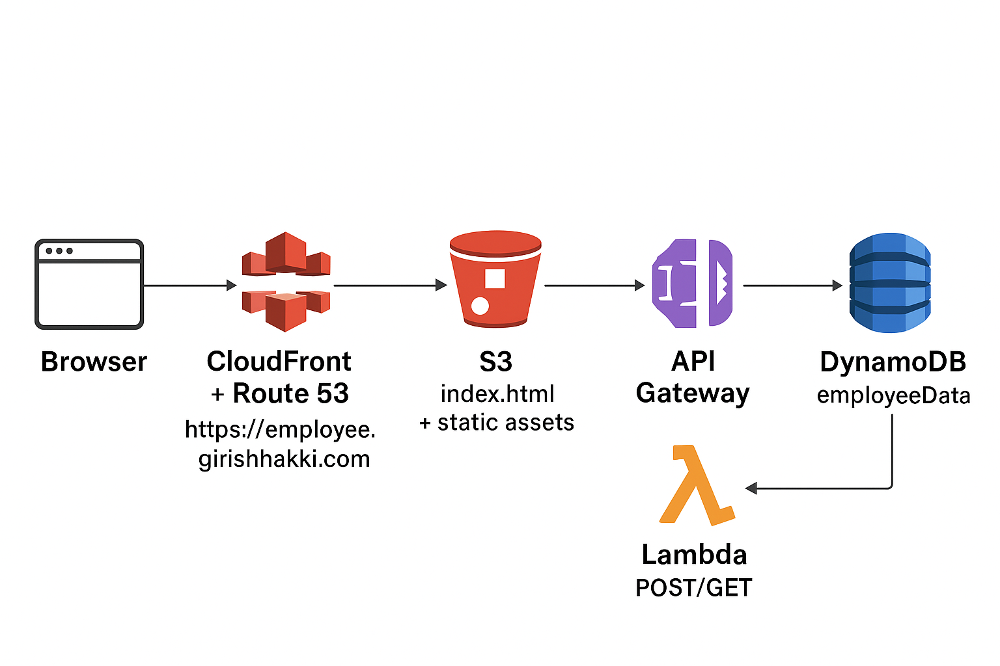
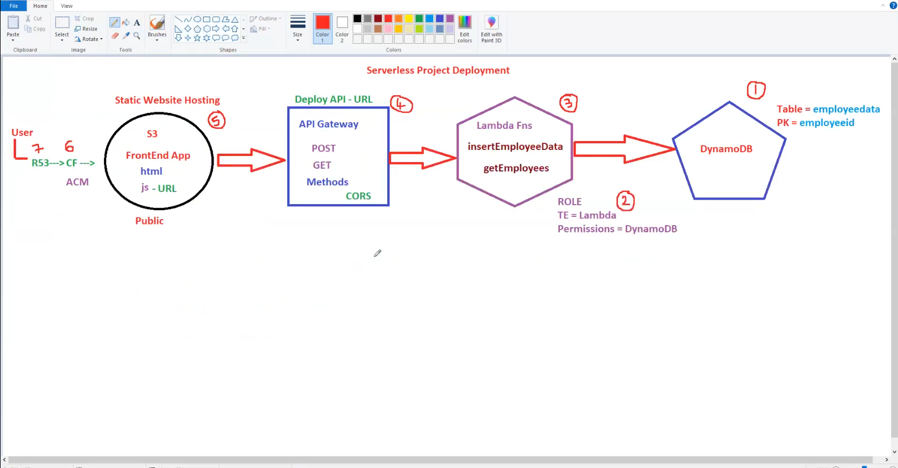

This project demonstrates a simple serverless CRUD-like app that stores employee data (Employee ID, Name, Department, Salary) using AWS services: DynamoDB, Lambda, API Gateway, S3 + CloudFront, ACM, and Route 53. The frontend is a static HTML/CSS/JS page hosted on S3/CloudFront that calls Lambda-backed APIs (POST to save, GET to list). Below is a ready-to-publish Medium article that explains the theory, architecture, code and best practices

— — — — — — — — — — — — — — — — — — — — — — — — — — — — — — — — — — — — — —

Introduction
Serverless architectures let you focus on application code while cloud providers manage servers, scaling, and availability. In this project we build a simple employee directory web app that uses serverless building blocks:

DynamoDB to persist employee records.
AWS Lambda to read/write data.
API Gateway (REST) to expose HTTP endpoints for the frontend.
S3 + CloudFront to serve a static frontend (HTML/CSS/JS).
ACM (Certificate Manager) + Route53 to serve the app on a custom HTTPS domain.
— — — — — — — — — — — — — — — — — — — — — — — — — — — — — — — — — — — — — —

Architecture (high-level)

— — — — — — — — — — — — — — — — — — — — — — — — — — — — — — — — — — — — — —

Why these services?
DynamoDB: serverless NoSQL — scales automatically, low latency. Suited for small, structured datasets.
Lambda: serverless compute — you only pay when functions execute.
API Gateway: exposes REST endpoints, handles throttling & CORS, connects to Lambda.
S3 + CloudFront: cheap and fast static hosting globally.
ACM + Route53: provide HTTPS and DNS using AWS managed certificates and records.
— — — — — — — — — — — — — — — — — — — — — — — — — — — — — — — — — — — — — —

Data model
DynamoDB table: employeeData

Partition Key: employeeid (String)
No sort key required for this simple table.
Example record:
{
  "employeeid": "E1001",
  "name": "AAA",
  "department": "DevOps",
  "salary": "30000"
}
— — — — — — — — — — — — — — — — — — — — — — — — — — — — — — — — — — — — — —

Lambda functions
Create two Lambda functions:

insertEmployeeData — POST handler to save an employee.
getEmployees — GET handler to return all employees.
Recommended production-ready POST Lambda (Python)
This version handles proxy integration, validates input, and returns CORS headers:

import json
import boto3
dynamodb = boto3.resource('dynamodb', region_name='ap-south-1')
table = dynamodb.Table('employeeData')
def lambda_handler(event, context):
    try:
        body = event.get('body')
        if isinstance(body, str):
            body = json.loads(body)
        employeeid = body.get('employeeid') or body.get('EmployeeID')
        name = body.get('name') or body.get('Name')
        department = body.get('department') or body.get('Department')
        salary = body.get('salary') or body.get('Salary')
        if not all([employeeid, name, department, salary]):
            return {
                'statusCode': 400,
                'headers': {'Access-Control-Allow-Origin': '*'},
                'body': json.dumps({'message': 'Missing required fields'})
            }
        table.put_item(Item={
            'employeeid': str(employeeid),
            'name': name,
            'department': department,
            'salary': str(salary)
        })
        return {
            'statusCode': 200,
            'headers': {'Access-Control-Allow-Origin': '*'},
            'body': json.dumps({'message': 'Employee saved successfully'})
        }
    except Exception as e:
        return {
            'statusCode': 500,
            'headers': {'Access-Control-Allow-Origin': '*'},
            'body': json.dumps({'error': str(e)})
        }
Recommended production-ready GET Lambda (Python)
import json
import boto3
dynamodb = boto3.resource('dynamodb', region_name='ap-south-1')
table = dynamodb.Table('employeeData')
def lambda_handler(event, context):
    try:
        response = table.scan()
        data = response.get('Items', [])
        while 'LastEvaluatedKey' in response:
            response = table.scan(ExclusiveStartKey=response['LastEvaluatedKey'])
            data.extend(response.get('Items', []))
        return {
            'statusCode': 200,
            'headers': {'Access-Control-Allow-Origin': '*'},
            'body': json.dumps(data)
        }
    except Exception as e:
        return {
            'statusCode': 500,
            'headers': {'Access-Control-Allow-Origin': '*'},
            'body': json.dumps({'error': str(e)})
        }
Press enter or click to view image in full size

— — — — — — — — — — — — — — — — — — — — — — — — — — — — — — — — — — — — — —

Frontend (index.html)
Static page contains a form for Employee ID, Name, Department, Salary, and two actions:

Save Employee Data → sends a POST request to your API.
View all Employees → sends a GET request and renders a table.
Press enter or click to view image in full size

— — — — — — — — — — — — — — — — — — — — — — — — — — — — — — — — — — — — — —

API Gateway & CORS
Create REST API, add GET and POST methods on the root resource (or a resource like /employees).
Integrate methods with Lambda functions.
Enable CORS for GET and POST in API Gateway (this adds OPTIONS and necessary headers).
If you use Lambda proxy integration, ensure Lambda responses include Access-Control-Allow-Origin header too.
Test APIs in the API Gateway console and from browser (network tab) to validate responses and headers.
Press enter or click to view image in full size

— — — — — — — — — — — — — — — — — — — — — — — — — — — — — — — — — — — — — —

IAM roles & permissions
Created an IAM Role for Lambda (e.g., serverless-project-220) and attached AmazonDynamoDBFullAccess. That works for demo, but in production prefer least-privilege:

Create a custom policy scoped to the table and actions:

{
  "Version": "2012-10-17",
  "Statement": [
    {
      "Effect": "Allow",
      "Action": ["dynamodb:PutItem", "dynamodb:Scan", "dynamodb:GetItem", "dynamodb:Query"],
      "Resource": "arn:aws:dynamodb:ap-south-1:ACCOUNT_ID:table/employeeData"
    }
  ]
}
Attach this policy to the Lambda execution role. Also avoid embedding AWS keys in the frontend — Lambdas assume roles.

— — — — — — — — — — — — — — — — — — — — — — — — — — — — — — — — — — — — — —

S3 + CloudFront + ACM + Route53 explained
S3 bucket = stores index.html and other static assets.
Enable Static Website Hosting or use CloudFront origin type S3.
If using CloudFront, you can keep the S3 bucket private and let CloudFront access it via an Origin Access Identity (OAI) or Origin Access Control (OAC).
CloudFront = speeds up content using edge locations and also allows TLS termination with a custom domain.
Request an ACM certificate in us-east-1 (N. Virginia) — CloudFront requires ACM certs from this region.
Add the certificate to the CloudFront distribution (Alternate Domain Name set to your domain).
Set Default Root Object = index.html.
Route53 = Create a hosted zone for your domain, add an A (Alias) record pointing to the CloudFront distribution. That gives you https://employee.yourdomain.com.
ACM DNS Validation = If you requested a wildcard certificate *.yourdomain.cloud, ACM will require creating a CNAME in Route53 to validate it. Once “INSYNC”, the certificate status becomes Issued.
Press enter or click to view image in full size

Deployment checklist (quick summary)
Create DynamoDB table employeeData.
Create IAM role for Lambda (least privilege recommended).
Create insertEmployeeData and getEmployees Lambdas, paste code, deploy.
Create API Gateway REST API — create POST and GET, integrate with Lambdas.
Enable CORS for GET/POST.
Deploy API to stage employeeapi. Note the invoke URL (use this in frontend).
Create S3 bucket employee.yourdomain.com and upload index.html.
Create CloudFront distribution with S3 origin and ACM cert, set Alternate Domain.
Add Route53 A-record (alias) pointing employee.yourdomain.com to CloudFront.
Validate everything, test in an incognito window using https://employee.yourdomain.com.
Testing & Troubleshooting
Browser DevTools: Network tab is your friend — inspect requests, response codes, and CORS issues.
CloudWatch Logs: Check Lambda logs for runtime errors and print statements.
API Gateway Test: Use the “Test” console in API Gateway to invoke Lambda directly and inspect responses.
CORS errors: If you see Access-Control-Allow-Origin missing — ensure API Gateway CORS is enabled AND that Lambda responses include the header when using proxy integration.
403 on CloudFront: Check S3 bucket policy and CloudFront origin access config (OAI/OAC).
502/504: Check Lambda function timeouts and memory. Increase memory or timeout if necessary.
Cost & clean-up
Resources can incur charges (DynamoDB, Lambda invocations, CloudFront, Route53 hosted zones). For a demo:
Use minimal provisioned capacity or prefer DynamoDB On-Demand for small apps.
Delete unused resources after demo:
Delete CloudFront distribution (wait for disabling + invalidation)
Delete S3 bucket and objects
Delete DynamoDB table
Delete API Gateway API
Delete Lambda functions + IAM role
Remove Route53 records and ACM certificate (if not reused)
Improvements & next steps
Add DELETE and PUT endpoints for full CRUD.
Add input validation and sanitization in Lambda.
Add pagination for DynamoDB scans (use Limit and LastEvaluatedKey).
Protect API with Cognito (user sign-in) or an API key / JWT.
Move to infrastructure-as-code: AWS SAM, Serverless Framework, or Terraform for reproducible deployments.
Add automated CI/CD to deploy Lambda and invalidate CloudFront cache on new frontend updates.
— — — — — — — — — — — — — — — — — — — — — — — — — — — — — — — — — — — — — —

Conclusion
This serverless project demonstrates how to build, deploy, and host a static frontend that communicates with Lambda functions and DynamoDB via API Gateway — all using managed AWS services. It’s low-cost, simple to reproduce, and a great portfolio piece. Follow the best-practices above (CORS, IAM least privilege, CloudFront+ACM) and your app will be secure and production-friendly.

— — — — — — — — — — — — — — — — — — — — — — — — — — — — — — — — — — — — — —

The END
