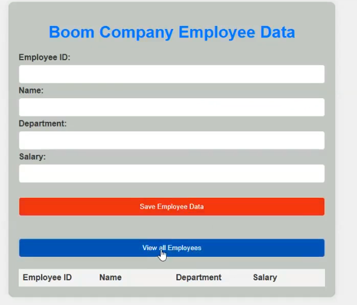

This project demonstrates a simple serverless CRUD-like app that stores employee data (Employee ID, Name, Department, Salary) using AWS services: DynamoDB, Lambda, API Gateway, S3 + CloudFront, ACM, and Route 53. The frontend is a static HTML/CSS/JS page hosted on S3/CloudFront that calls Lambda-backed APIs (POST to save, GET to list). Below is a ready-to-publish Medium article that explains the theory, architecture, code and best practices

— — — — — — — — — — — — — — — — — — — — — — — — — — — — — — — — — — — — — —

## Introduction
Serverless architectures let you focus on application code while cloud providers manage servers, scaling, and availability. In this project we build a simple employee directory web app that uses serverless building blocks:

## DynamoDB to persist employee records.
AWS Lambda to read/write data.
API Gateway (REST) to expose HTTP endpoints for the frontend.
S3 + CloudFront to serve a static frontend (HTML/CSS/JS).
ACM (Certificate Manager) + Route53 to serve the app on a custom HTTPS domain.
— — — — — — — — — — — — — — — — — — — — — — — — — — — — — — — — — — — — — —

## Architecture (high-level)

— — — — — — — — — — — — — — — — — — — — — — — — — — — — — — — — — — — — — —

## Why these services?
DynamoDB: serverless NoSQL — scales automatically, low latency. Suited for small, structured datasets.
Lambda: serverless compute — you only pay when functions execute.
API Gateway: exposes REST endpoints, handles throttling & CORS, connects to Lambda.
S3 + CloudFront: cheap and fast static hosting globally.
ACM + Route53: provide HTTPS and DNS using AWS managed certificates and records.
— — — — — — — — — — — — — — — — — — — — — — — — — — — — — — — — — — — — — —

## Data model
DynamoDB table: employeeData

Partition Key: employeeid (String)
No sort key required for this simple table.
Example record:
{
  "employeeid": "E1001",
  "name": "AAA",
  "department": "DevOps",
  "salary": "30000"
}
— — — — — — — — — — — — — — — — — — — — — — — — — — — — — — — — — — — — — —

## Lambda functions
Create two Lambda functions:

insertEmployeeData — POST handler to save an employee.
getEmployees — GET handler to return all employees.
Recommended production-ready POST Lambda (Python)
This version handles proxy integration, validates input, and returns CORS headers:

import json
import boto3
dynamodb = boto3.resource('dynamodb', region_name='ap-south-1')
table = dynamodb.Table('employeeData')
def lambda_handler(event, context):
    try:
        body = event.get('body')
        if isinstance(body, str):
            body = json.loads(body)
        employeeid = body.get('employeeid') or body.get('EmployeeID')
        name = body.get('name') or body.get('Name')
        department = body.get('department') or body.get('Department')
        salary = body.get('salary') or body.get('Salary')
        if not all([employeeid, name, department, salary]):
            return {
                'statusCode': 400,
                'headers': {'Access-Control-Allow-Origin': '*'},
                'body': json.dumps({'message': 'Missing required fields'})
            }
        table.put_item(Item={
            'employeeid': str(employeeid),
            'name': name,
            'department': department,
            'salary': str(salary)
        })
        return {
            'statusCode': 200,
            'headers': {'Access-Control-Allow-Origin': '*'},
            'body': json.dumps({'message': 'Employee saved successfully'})
        }
    except Exception as e:
        return {
            'statusCode': 500,
            'headers': {'Access-Control-Allow-Origin': '*'},
            'body': json.dumps({'error': str(e)})
        }
Recommended production-ready GET Lambda (Python)
import json
import boto3
dynamodb = boto3.resource('dynamodb', region_name='ap-south-1')
table = dynamodb.Table('employeeData')
def lambda_handler(event, context):
    try:
        response = table.scan()
        data = response.get('Items', [])
        while 'LastEvaluatedKey' in response:
            response = table.scan(ExclusiveStartKey=response['LastEvaluatedKey'])
            data.extend(response.get('Items', []))
        return {
            'statusCode': 200,
            'headers': {'Access-Control-Allow-Origin': '*'},
            'body': json.dumps(data)
        }
    except Exception as e:
        return {
            'statusCode': 500,
            'headers': {'Access-Control-Allow-Origin': '*'},
            'body': json.dumps({'error': str(e)})
        }
        

— — — — — — — — — — — — — — — — — — — — — — — — — — — — — — — — — — — — — —

## Frontend (index.html)
Static page contains a form for Employee ID, Name, Department, Salary, and two actions:

Save Employee Data → sends a POST request to your API.
View all Employees → sends a GET request and renders a table.

— — — — — — — — — — — — — — — — — — — — — — — — — — — — — — — — — — — — — —

## API Gateway & CORS
Create REST API, add GET and POST methods on the root resource (or a resource like /employees).
Integrate methods with Lambda functions.
Enable CORS for GET and POST in API Gateway (this adds OPTIONS and necessary headers).
If you use Lambda proxy integration, ensure Lambda responses include Access-Control-Allow-Origin header too.
Test APIs in the API Gateway console and from browser (network tab) to validate responses and headers.

— — — — — — — — — — — — — — — — — — — — — — — — — — — — — — — — — — — — — —

## IAM roles & permissions
Created an IAM Role for Lambda (e.g., serverless-project-220) and attached AmazonDynamoDBFullAccess. That works for demo, but in production prefer least-privilege:

Create a custom policy scoped to the table and actions:

{
  "Version": "2012-10-17",
  "Statement": [
    {
      "Effect": "Allow",
      "Action": ["dynamodb:PutItem", "dynamodb:Scan", "dynamodb:GetItem", "dynamodb:Query"],
      "Resource": "arn:aws:dynamodb:ap-south-1:ACCOUNT_ID:table/employeeData"
    }
  ]
}
Attach this policy to the Lambda execution role. Also avoid embedding AWS keys in the frontend — Lambdas assume roles.

— — — — — — — — — — — — — — — — — — — — — — — — — — — — — — — — — — — — — —

## S3 + CloudFront + ACM + Route53 explained
S3 bucket = stores index.html and other static assets.
Enable Static Website Hosting or use CloudFront origin type S3.
If using CloudFront, you can keep the S3 bucket private and let CloudFront access it via an Origin Access Identity (OAI) or Origin Access Control (OAC).
CloudFront = speeds up content using edge locations and also allows TLS termination with a custom domain.
Request an ACM certificate in us-east-1 (N. Virginia) — CloudFront requires ACM certs from this region.
Add the certificate to the CloudFront distribution (Alternate Domain Name set to your domain).
Set Default Root Object = index.html.
Route53 = Create a hosted zone for your domain, add an A (Alias) record pointing to the CloudFront distribution. That gives you https://employee.yourdomain.com.
ACM DNS Validation = If you requested a wildcard certificate *.yourdomain.cloud, ACM will require creating a CNAME in Route53 to validate it. Once “INSYNC”, the certificate status becomes Issued.

## 🚀 Deployment Steps
🧩 Create and Configure the Backend (API Gateway + Lambda)

Create an API Gateway REST API.

Add POST and GET methods.

Integrate each method with corresponding AWS Lambda functions.

Enable CORS for both GET and POST methods.

Deploy the API to a stage named employeeapi.

Note down the Invoke URL — you’ll use this in the frontend JavaScript.

## 🗂️ Set Up the Frontend (S3 + CloudFront + Route53)

Create an S3 bucket named employee.yourdomain.com.

Upload your index.html and other static assets to the bucket.

Create a CloudFront distribution:

Set S3 as the origin.

Attach an ACM SSL certificate for HTTPS.

Set an Alternate Domain Name (CNAME) to employee.yourdomain.com.

In Route 53, create an A-record (alias) pointing employee.yourdomain.com to the CloudFront distribution.

Once deployed, test everything using
👉 https://employee.yourdomain.com
(use an incognito window to avoid caching issues).

## 🧪 Testing & Troubleshooting

Browser DevTools

Use the Network tab to inspect API requests, response codes, and CORS headers.

CloudWatch Logs

Review Lambda logs for runtime errors or console.log outputs.

API Gateway Test Console

Invoke Lambda functions directly and inspect API responses.

CORS Errors

If you see missing Access-Control-Allow-Origin, ensure:

API Gateway CORS is enabled, and

Lambda responses include the header when using proxy integration.

403 Errors (CloudFront)

Check S3 bucket policy and CloudFront Origin Access Identity (OAI/OAC) configuration.

502 / 504 Errors

Check Lambda timeout and memory settings.

Increase resources if necessary.

## 💰 Cost & Clean-Up

AWS resources can incur small charges (DynamoDB, Lambda, CloudFront, Route53).

For Demo / Testing Environments:

Use DynamoDB On-Demand (instead of provisioned capacity).

Keep Lambda and API Gateway in free-tier usage if possible.

When Cleaning Up:

Delete CloudFront distribution (wait for it to disable and invalidate).

Delete S3 bucket and objects.

Delete DynamoDB table.

Delete API Gateway API.

Delete Lambda functions and IAM roles.

Remove Route 53 records and ACM certificates (if not reused).

## 🔧 Improvements & Next Steps

Add DELETE and PUT endpoints for full CRUD support.

Add input validation and sanitization in Lambda.

Add pagination for DynamoDB scans using Limit and LastEvaluatedKey.

Secure API using Cognito, API keys, or JWT authentication.

Move to Infrastructure-as-Code (IaC) tools:

AWS SAM, Serverless Framework, or Terraform.

Add CI/CD automation to:

Deploy Lambda updates automatically.

Invalidate CloudFront cache after frontend updates.
— — — — — — — — — — — — — — — — — — — — — — — — — — — — — — — — — — — — — —

## Conclusion
This serverless project demonstrates how to build, deploy, and host a static frontend that communicates with Lambda functions and DynamoDB via API Gateway — all using managed AWS services. It’s low-cost, simple to reproduce, and a great portfolio piece. Follow the best-practices above (CORS, IAM least privilege, CloudFront+ACM) and your app will be secure and production-friendly.

— — — — — — — — — — — — — — — — — — — — — — — — — — — — — — — — — — — — — —

## The END
