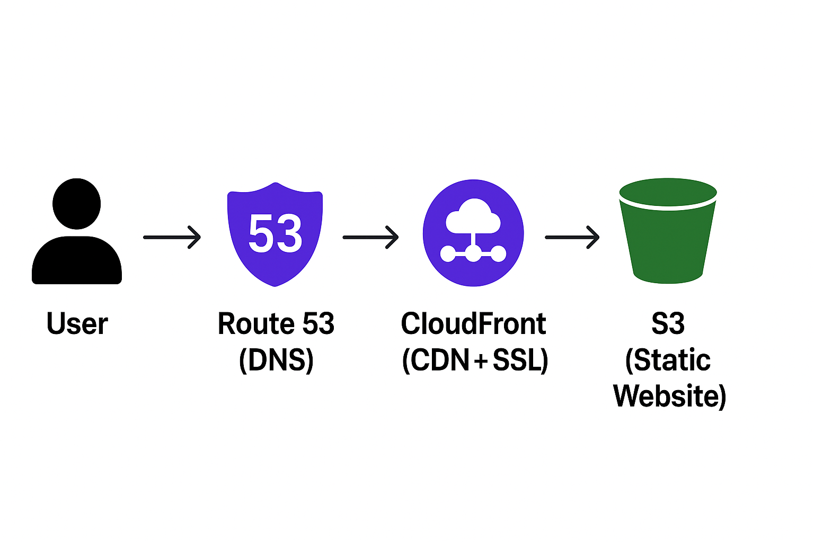

🏗️ Introduction
In this project, I hosted a static website securely on AWS using Amazon S3, CloudFront, Route 53, and AWS Certificate Manager (ACM).
This setup is one of the most common architectures used by AWS DevOps Engineers for website hosting, where performance, scalability, and security are key.

Here’s what we’ll achieve by the end of this project 👇
✅ Host static website files in S3
✅ Distribute content globally using CloudFront CDN
✅ Use a custom domain (from GoDaddy) managed via Route 53
✅ Enable HTTPS using AWS Certificate Manager (ACM)

— — — — — — — — — — — — — — — — — — — — — — — — — — — — — — — — — — — — — —

🌐 Architecture Diagram

User → Route 53 (DNS) → CloudFront (CDN + SSL) → S3 (Static Website)
Description:

Amazon S3 stores the website content (HTML, CSS, JS, images).
CloudFront securely delivers content globally with low latency.
AWS ACM issues the SSL certificate for HTTPS.
Route 53 maps your custom domain (e.g. cloudfront.yourdomain.com) to the CloudFront distribution.
— — — — — — — — — — — — — — — — — — — — — — — — — — — — — — — — — — — — — —

⚙️ Step-by-Step Implementation
Step 1️⃣ — Create an S3 Bucket
Go to AWS S3 Console → Click Create bucket.
Bucket name → use your domain name (e.g. yourdomain.com).
Uncheck “Block all public access” if you want to host a static website directly,
but for CloudFront setup, keep it private (CloudFront will handle access).
Upload your website files (index.html, styles, images, etc.).
— — — — — — — — — — — — — — — — — — — — — — — — — — — — — — — — — — — — — —

Step 2️⃣ — Request an SSL Certificate in ACM
Go to AWS Certificate Manager (ACM) in us-east-1 (N. Virginia).
Click Request a Public Certificate.
Add domain names:
e.g. yourdomain.com
4. Choose DNS validation and click Request.

5. Copy the CNAME Name and CNAME Value from ACM.

6. Go to Route 53 → Hosted Zone → Create Record and add that CNAME record.

7. Wait until the certificate status shows Issued ✅.

— — — — — — — — — — — — — — — — — — — — — — — — — — — — — — — — — — — — — —

Step 3️⃣ — Create a CloudFront Distribution
Open AWS CloudFront Console → Create Distribution.
Origin Domain → Choose your S3 bucket.
Under Origin Access, create an Origin Access Control (OAC) to allow CloudFront to access your private bucket.
Enable Redirect HTTP to HTTPS (for secure traffic).
In Alternate Domain Name (CNAME), enter:
cloudfront.yourdomain.com
6. Under Custom SSL Certificate, select your issued ACM certificate

7. Click Create Distribution.

✅ After creation, you’ll get a CloudFront domain like:

d####4jmp##f2.yourdomain.com
Press enter or click to view image in full size

— — — — — — — — — — — — — — — — — — — — — — — — — — — — — — — — — — — — — —

Step 4️⃣ — Update S3 Bucket Policy
To allow CloudFront to access your S3 bucket, the following policy will usually be auto-applied:

{
  "Version": "2012-10-17",
  "Statement": [
    {
      "Sid": "AllowCloudFrontServicePrincipalReadOnly",
      "Effect": "Allow",
      "Principal": {
        "Service": "cloudfront.yourdomain.com"
      },
      "Action": "s3:GetObject",
      "Resource": "arn:aws:s3:::your-bucket-name/*",
      "Condition": {
        "StringEquals": {
          "AWS:SourceArn": "arn:aws:cloudfront::<your-account-id>:distribution/<your-distribution-id>"
        }
      }
    }
  ]
}
Press enter or click to view image in full size
Press enter or click to view image in full size
— — — — — — — — — — — — — — — — — — — — — — — — — — — — — — — — — — — — — —

Step 5️⃣ — Create DNS Record in Route 53
Go to Route 53 → Hosted Zone → yourdomain.com → Create Record.
Add:
Name : cloudfront
Type : CNAME
Value : d##9b4#m#3##2.cloudfront.net
Save the record.
Wait a few minutes for DNS propagation.
Now visiting
👉 https://cloudfront.yourdomain.com
will show your S3 website served securely via CloudFront and HTTPS 🔒

— — — — — — — — — — — — — — — — — — — — — — — — — — — — — — — — — — — — — —

📈 Benefits of This Architecture
S3 → Stores static content cost-effectively

CloudFront > Speeds up delivery and adds security

ACM → Provides free managed SSL certificates

Route 53 → Handles DNS and domain routing

Private S3 + CloudFront OAC → Ensures content is not publicly accessible

— — — — — — — — — — — — — — — — — — — — — — — — — — — — — — — — — — — — — —

🧩 Real-World Use Case
This setup is commonly used by companies to:

Host static front-end websites (React, Angular, HTML).
Deploy documentation portals or landing pages.
Serve static assets (images, CSS, JS) securely and globally.
— — — — — — — — — — — — — — — — — — — — — — — — — — — — — — — — — — — — — —

🏁Conclusion
In this project, I successfully hosted a secure, scalable, and globally distributed website on AWS.
By integrating S3, CloudFront, Route 53, and ACM, I achieved:

Cost-effective storage
Low latency global delivery
HTTPS security
Custom domain integration
This project demonstrates core AWS and DevOps skills — perfect for showcasing on resumes and portfolios 🚀

Press enter or click to view image in full size

