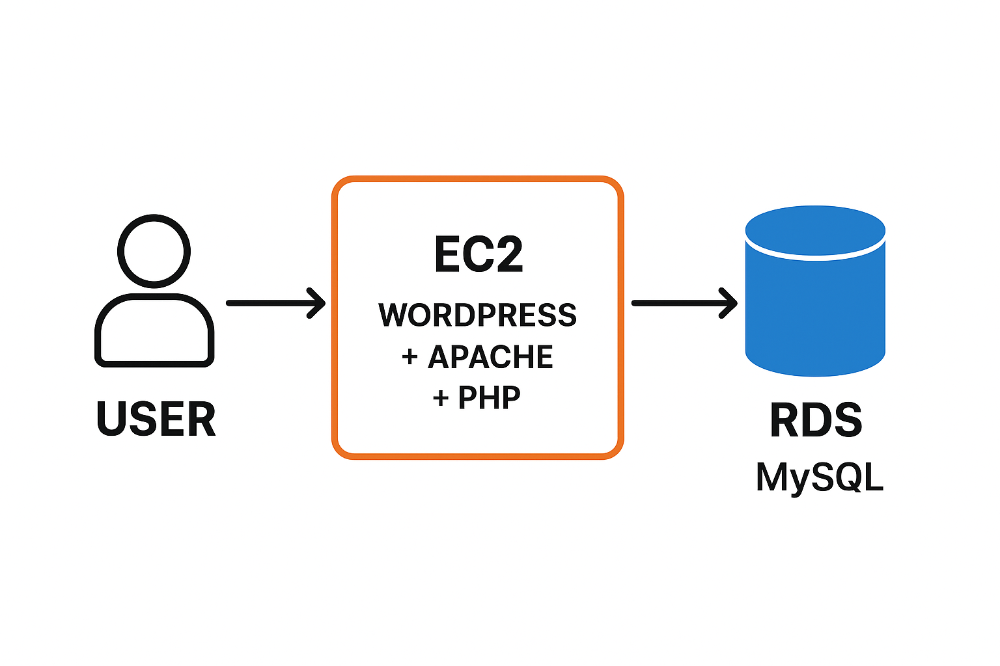
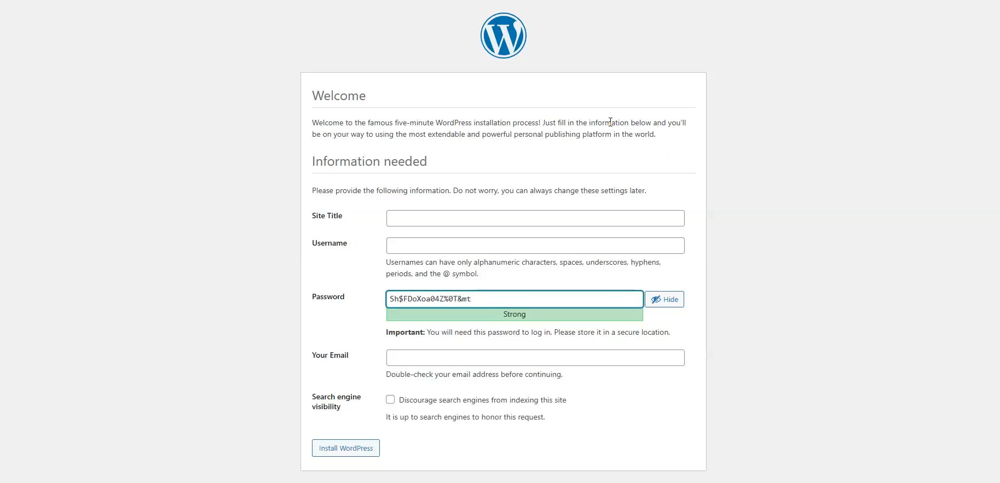
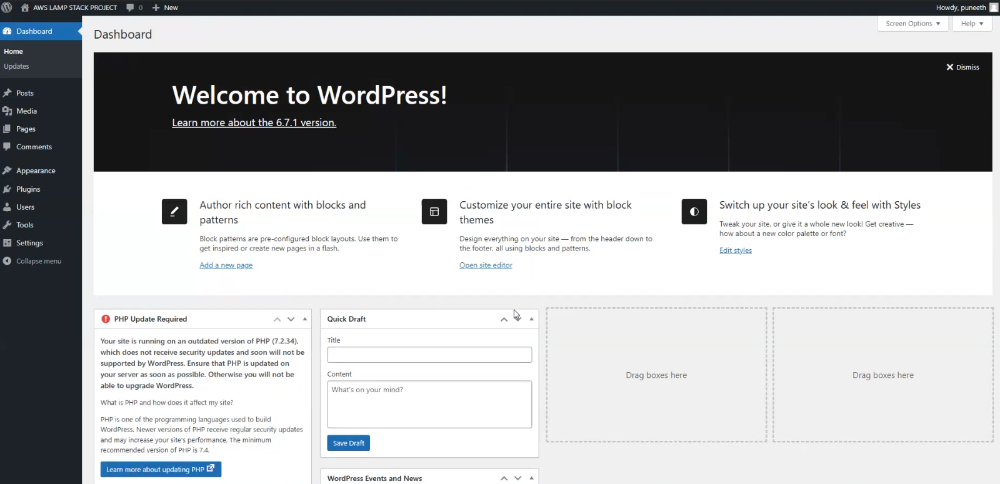

🧠 Project Overview
In this project, we’ll host a fully functional WordPress website on AWS EC2 using the LAMP Stack (Linux, Apache, MySQL, PHP).
Instead of storing the WordPress database locally, we’ll use Amazon RDS (MySQL) for better scalability, security, and high availability.

This project demonstrates how to set up a cloud-hosted WordPress environment with proper networking, database connection, and Apache web server configuration — all under AWS Free Tier.

User → EC2 (WordPress + Apache + PHP) → RDS (MySQL Database)
— — — — — — — — — — — — — — — — — — — — — — — — — — — — — — — — — — — — — —

⚙️ Step-by-Step Implementation
🧩 Step 1: Create RDS Database (MySQL)
Go to AWS RDS → Create database
Choose Standard create
Engine options: MySQL
Version: Any latest stable version
Template: Free Tier
Availability & Durability: Single-AZ (Free tier eligible)
Settings:
DB instance identifier: mysqlamp
Master username: admin
Password: yourpwd
8. Instance configuration: db.t3.micro
9. Storage:

Type: General Purpose SSD (gp2)
Size: 20GB
Disable Auto-scaling
10. Connectivity:

VPC: Default
Public access: No
Database authentication: Password
Initial DB name: awslampproject
Click Create database
✅ Wait until the status shows “Available”.

— — — — — — — — — — — — — — — — — — — — — — — — — — — — — — — — — — — — — —

🔐 Step 2: Configure RDS Security Group
Go to Security Groups → Edit inbound rules
Add rule: Type: MySQL/Aurora and Port: 3306
Source: Your IP
Save changes.
— — — — — — — — — — — — — — — — — — — — — — — — — — — — — — — — — — — — — —

💻 Step 3: Launch EC2 Instance
Go to EC2 → Launch instance
Name: wordpress
AMI: Amazon Linux 2023 (Kernel 6.1)
Instance type: t2.micro
Key pair: yourkeypair
Subnet: 1a
Security Group: Default
Launch instance
Now go to your EC2 Security Group → Edit inbound rules

Add rule: HTTP (port 80) from My IP
— — — — — — — — — — — — — — — — — — — — — — — — — — — — — — — — — — — — — —

🧠 Step 4: Connect to EC2 and Install LAMP Stack
Login using PuTTY or EC2 Instance Connect.

sudo -s
Install required packages:
sudo dnf install -y httpd mariadb105-server php php-mysqlnd php-cli php-common php-json php-mbstring php-curl php-gd wget tar
Start Apache:

service httpd start
— — — — — — — — — — — — — — — — — — — — — — — — — — — — — — — — — — — — — —

🧩 Step 5: Connect EC2 to RDS Database
Get your RDS endpoint from the RDS console.

export MYSQL_HOST=yourlampproject.c9u8ckmqq2v5.ap-south-1.rds.amazonaws.com
mysql -h yourlampproject.c8u8fkrqw2v5.ap-south-1.rds.amazonaws.com -P 3306 -u admin -p
Enter password: yourpwd

Then run these SQL commands:

CREATE DATABASE wordpress;
CREATE USER 'wpuser' IDENTIFIED BY 'yourpwd';
GRANT ALL PRIVILEGES ON wordpress.* TO wpuser;
FLUSH PRIVILEGES;
EXIT;
— — — — — — — — — — — — — — — — — — — — — — — — — — — — — — — — — — — — — —

Step 6: Download and Configure WordPress
wget https://wordpress.org/latest.tar.gz
tar -xzf latest.tar.gz
cd wordpress/
cp wp-config-sample.php wp-config.php
vi wp-config.php
Edit the following lines:

define( 'DB_NAME', 'wordpress' );
define( 'DB_USER', 'wpuser' );
define( 'DB_PASSWORD', 'yourpwd' );
define( 'DB_HOST', 'yourlampproject.c9u8ckmqq2v5.ap-south-1.rds.amazonaws.com' );
— — — — — — — — — — — — — — — — — — — — — — — — — — — — — — — — — — — — — —

🔑 Step 7: Add WordPress Secret Keys
Open the following link in your browser:
👉 https://api.wordpress.org/secret-key/1.1/salt/

Copy all the keys and replace the corresponding lines in wp-config.php.

Then save and exit:

:wq!
📂 Step 8: Move WordPress Files to Web Root
cd ..
cp -r wordpress/* /var/www/html/
Verify:

cd /var/www/html/
ls
Restart Apache:

service httpd restar
— — — — — — — — — — — — — — — — — — — — — — — — — — — — — — — — — — — — — —

🌍 Step 9: Access WordPress
Go to your browser
Paste your EC2 public IPv4 address
You’ll see the WordPress Installation Page 🎉
Complete the setup:

Site Title
Admin Username
Password
Email
And your WordPress website is live on AWS EC2 connected to an RDS database!

🧰 Step 10 (Optional): Create a Launch Template and Auto Scaling Group
After successfully deploying WordPress, create a Launch Template for auto-scaling.

Go to EC2 → Launch Templates → Create launch template
Name: wordpress-template
Source: Select existing instance → choose wordpress
Create template.
2. Go to Auto Scaling Groups

Create new group using the above template.
Set minimum and desired capacity as per your need.
Attach to the same subnet and load balancer if required.
— — — — — — — — — — — — — — — — — — — — — — — — — — — — — — — — — — — — — —

🔍 Key Learnings
Difference between hosting WordPress locally vs with RDS.
How LAMP stack integrates with AWS cloud services.
Importance of secure database connectivity (Private RDS + EC2 SG rules).
How to automate scalability using Launch Templates and Auto Scaling Groups.

🏁 Conclusion
We successfully hosted a WordPress website on AWS EC2 using a remote MySQL database in RDS with full LAMP stack integration.
This setup is ideal for beginners in AWS, DevOps, or Cloud Hosting who want to learn real-world architecture and deployment practices.

