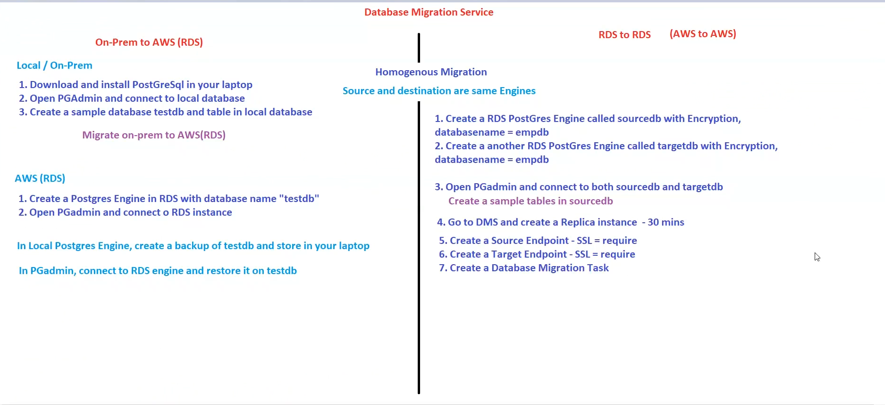
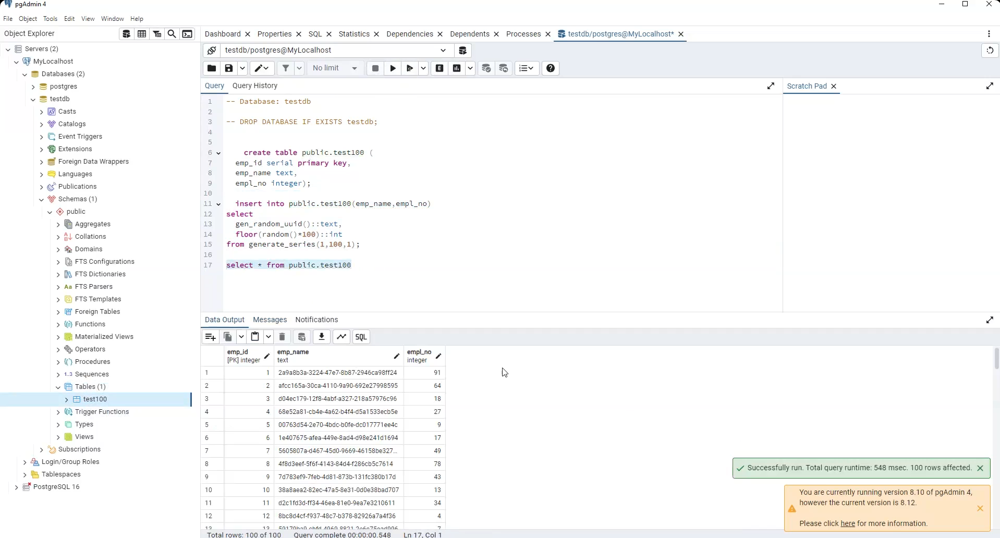

🚀 Migrating PostgreSQL Databases with AWS Database Migration Service (DMS): On-Prem to RDS and RDS to RDS

Database Migration Service Flow Chart
🔹 Introduction
In today’s cloud-first world, organizations are moving their databases to the cloud for scalability, performance, and cost optimization. AWS offers Database Migration Service (DMS), which makes this process seamless with minimal downtime.

In this project, I worked on two scenarios:

Migrating a local PostgreSQL database (on-prem) to Amazon RDS PostgreSQL.
Migrating data from one RDS PostgreSQL instance to another using AWS DMS.
This hands-on experience gave me a clear understanding of backup/restore migrations as well as replication-based migrations using DMS.

— — — — — — — — — — — — — — — — — — — — — — — — — — — — — — — — — — — — — —

🔹 Part 1: On-Prem → AWS RDS (PostgreSQL)
In this case, I had a local PostgreSQL database running on my laptop. The goal was to back it up and restore it into an RDS PostgreSQL instance.

Steps
Installed PostgreSQL locally.
Created a sample database testdb and table in pgAdmin.
On AWS, created an RDS PostgreSQL instance with the same database name (testdb).
Took a backup of the local database.
Restored the backup into the RDS PostgreSQL instance via pgAdmin.
Architecture
This approach works well for small databases and simple migrations, but it requires downtime since we must take a backup and restore.

— — — — — — — — — — — — — — — — — — — — — — — — — — — — — — — — — — — — — —

🔹 Part 2: RDS → RDS (Homogeneous Migration using DMS)
For larger migrations or when zero/minimal downtime is required, AWS DMS is the best option. Here, I migrated data between two RDS PostgreSQL instances (source and target).

Steps
Created Source RDS PostgreSQL (sourcedb).
Created Target RDS PostgreSQL (targetdb).
Connected both databases in pgAdmin and created sample tables in sourcedb.
In AWS DMS:
Launched a Replication Instance.
Created Source Endpoint (SSL enabled).
Created Target Endpoint (SSL enabled).
Created a Migration Task (Full Load + Ongoing Replication).
Architecture
DMS performed the full load of existing data and also handled ongoing replication (capturing ongoing changes from source to target). This ensures minimal downtime, making it production-ready.

— — — — — — — — — — — — — — — — — — — — — — — — — — — — — — — — — — — — — —

🔹 Challenges Faced
Endpoint connectivity issues: Solved by updating security groups and ensuring public access for testing.
SSL requirements: Configured endpoints with SSL to match DMS requirements.
IAM roles: Ensured DMS had the correct permissions to access RDS.
Press enter or click to view image in full size

— — — — — — — — — — — — — — — — — — — — — — — — — — — — — — — — — — — — — —

🔹Results
Successfully migrated testdb from on-prem PostgreSQL to AWS RDS PostgreSQL.
Migrated sourcedb to targetdb in RDS using DMS with ongoing replication.
Verified data in pgAdmin after migration.
Press enter or click to view image in full size

— — — — — — — — — — — — — — — — — — — — — — — — — — — — — — — — — — — — — —

🔹 Key Learnings
Backup/Restore works for simple migrations but introduces downtime.
AWS DMS is powerful for real-world migrations where uptime is critical.
Importance of correctly configuring security groups, endpoints, and IAM roles.
Homogeneous migrations (Postgres → Postgres) are straightforward, while heterogeneous ones (e.g., MySQL → Postgres) require AWS Schema Conversion Tool (SCT).
— — — — — — — — — — — — — — — — — — — — — — — — — — — — — — — — — — — — — —

🔹 Conclusion
This project gave me hands-on experience with two migration strategies:

On-Prem → RDS (Backup & Restore)
RDS → RDS (AWS DMS Replication)
With DMS, migrations can be achieved with minimal downtime and automation. This is especially useful when organizations move workloads to AWS at scale.

Next, I plan to explore heterogeneous migrations (PostgreSQL → MySQL) using DMS + AWS SCT.

— — — — — — — — — — — — — — — — — — — — — — — —
✅ If you found this useful, feel free to connect with me on LinkedIn or drop your thoughts in the comments!
